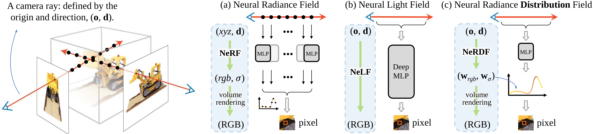

# NeDRF
> Efficient View Synthesis with Neural Radiance Distribution Field  
> [GAP Lab](https://gaplab.cuhk.edu.cn/), [Yushuang Wu](https://scholar.google.com/citations?hl=zh-CN&user=x5gpN0sAAAAJ)

[Paper](https://openaccess.thecvf.com/content/ICCV2023/papers/Wu_Efficient_View_Synthesis_with_Neural_Radiance_Distribution_Field_ICCV_2023_paper.pdf) - 
[Project Website](https://yushuang-wu.github.io/NeRDF/) -
[Arxiv](https://arxiv.org/abs/2308.11130) -
Published in ICCV 2023.

#### Citation

If you find our code or paper useful for your project, please consider citing:

    @inproceedings{wu2023nerdf,
      title={Efficient View Synthesis with Neural Radiance Distribution Field},
      author={Yushuang, Wu and Xiao, Li and Jinglu, Wang and Xiaoguang, Han and Shuguang, Cui and Yan, Lu},
      booktitle={The IEEE/CVF International Conference on Computer Vision (ICCV)},
      year={2023}
    }
